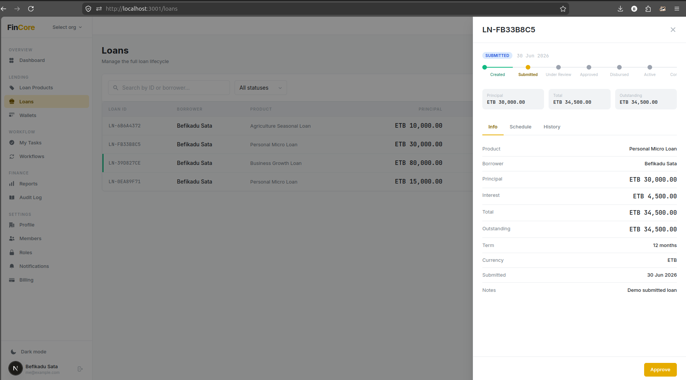
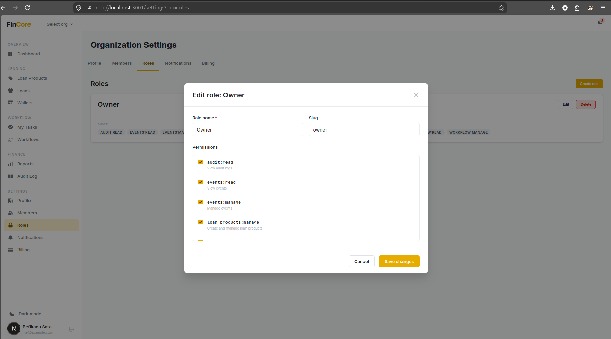
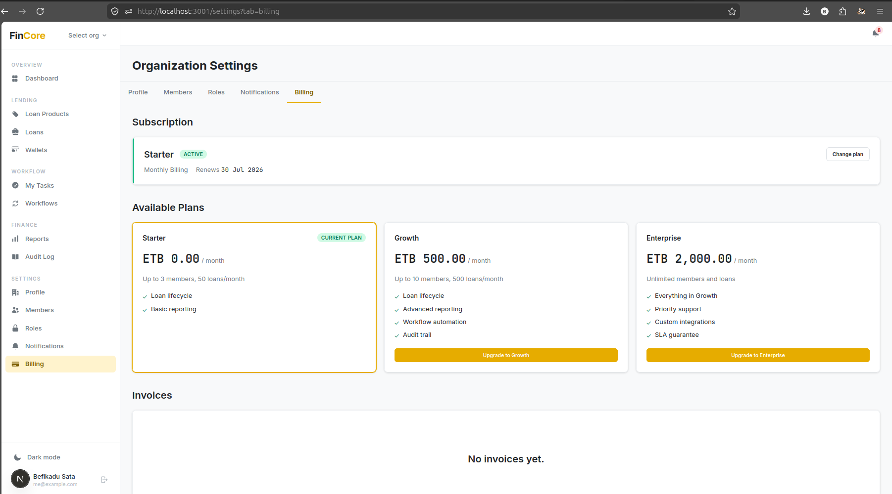

# FinCore

**Multi-tenant fintech SaaS platform** for loan lifecycle management, double-entry bookkeeping, and configurable workflow automation.

Built as a Django modular monolith with a Next.js frontend, FinCore demonstrates production-grade fintech architecture: tenant isolation, event-driven processing, compliance-grade audit trails, and an integrated billing system.

---

## What It Does

FinCore gives organizations a full lending operation out of the box:

- **Loan lifecycle** — from application through multi-step approval, disbursement, and repayment tracking
- **Double-entry ledger** — every transaction creates balanced ledger entries; books never go out of sync
- **Configurable workflows** — approval chains defined in JSON, no redeploys required
- **Audit trail** — immutable, append-only log of every action with actor, diff, and IP
- **Multi-tenant isolation** — one deployment serves many organizations; data never crosses tenants
- **Subscription billing** — Chapa payment integration with plan-based feature gating
- **In-app + email notifications** — event-driven, user-configurable per channel and event type

---

## Screenshots





---

## Tech Stack

### Backend

| Layer | Technology |
|---|---|
| Framework | Django 5.x + Django REST Framework |
| Database | PostgreSQL 16 |
| Cache & Events | Redis 7 (Redis Streams) |
| Async tasks | Celery 5 + Celery Beat |
| Auth | JWT via `djangorestframework-simplejwt` |
| Payments | Chapa (abstract gateway pattern) |
| Testing | pytest + factory_boy + faker |
| Containerization | Docker + Docker Compose |

### Frontend

| Layer | Technology |
|---|---|
| Framework | Next.js (App Router) + TypeScript |
| Styling | Tailwind CSS v4 (CSS-variable design token bridge) |
| Server state | TanStack Query |
| Client state | Zustand |
| Forms | React Hook Form + Zod |
| UI components | Custom design system (10 base + 6 domain components) |

---

## Architecture

FinCore follows a **modular monolith** organized around bounded contexts. Each domain module (`saas`, `finance`, `workflow`, `audit`, `events`, `notifications`, `billing`) owns its models, services, and API layer. The `core/` package provides shared infrastructure used across all modules.

```
Request → JWT Auth → TenantMiddleware → IdempotencyMiddleware → DRF ViewSet
                                                                      ↓
                                                               Service Layer
                                                                      ↓
                                                          EventBus (Redis Streams)
                                                                      ↓
                                                         Celery Workers → Handlers
```

### Key Architectural Decisions

| Decision | Choice | Rationale |
|---|---|---|
| Multi-tenancy | Shared schema with `tenant_id` FK | Simple to operate; proven at scale. Schema-per-tenant is a migration path, not day-one cost. |
| Ledger | Double-entry bookkeeping | Financial integrity guarantee — every transaction balances by construction. |
| Workflow engine | JSON-defined templates stored in DB | Tenants configure approval chains without deployments. |
| Event system | Redis Streams → Celery consumers | Decoupled, retryable, with a clear Kafka upgrade path. |
| Idempotency | Client-supplied `Idempotency-Key` header | Stripe pattern — prevents duplicate disbursements and repayments. |
| RBAC | Custom `Role` + `Permission`, tenant-scoped | Granular (`loan:approve`), decoupled from Django's auth, and fully auditable. |
| Payment gateway | Abstract `PaymentGateway` protocol | Swap Chapa for Stripe by implementing one class. |

Full decision registry: [`docs/fincore_architecture.md`](docs/fincore_architecture.md)

---

## Project Structure

```
fincore/
├── backend/
│   ├── config/               # Django settings (base / dev / prod / test)
│   ├── core/                 # Shared kernel: BaseModel, TenantManager, middlewares, decorators
│   └── apps/
│       ├── saas/             # Tenants, users, memberships, roles, permissions, plans
│       ├── finance/          # Loan products, loans, wallets, ledger, repayment schedules
│       ├── workflow/         # Workflow definitions, instances, step execution engine
│       ├── audit/            # Immutable AuditLog, @auditable decorator
│       ├── events/           # DomainEvent model, EventBus, Redis Streams consumer
│       ├── notifications/    # Notification model, InApp + Email channels, preferences
│       └── billing/          # Subscription, Invoice, PaymentRecord, Chapa gateway
├── frontend/
│   └── src/
│       ├── app/              # Next.js App Router pages (auth + dashboard routes)
│       ├── components/
│       │   ├── ui/           # 10 base components (Button, Table, Modal, Drawer, …)
│       │   └── domain/       # 6 domain components (AmountDisplay, LoanTimeline, …)
│       └── lib/              # API client, format utils, status utils, Zod schemas
├── docs/                     # Architecture document, implementation plan, design system
└── docker/                   # Docker Compose for full local stack
```

---

## Loan Lifecycle

```
CREATED → SUBMITTED → UNDER_REVIEW → APPROVED → DISBURSED → ACTIVE → COMPLETED
                                   ↘ REJECTED              ↘ DEFAULTED
```

Each transition is event-driven: submitting a loan fires `loan.submitted`, which triggers the configured approval workflow. Once all workflow steps pass, `loan.approved` fires and the engine automatically disburses funds to the borrower's wallet via double-entry ledger entries.

---

## API Surface

All endpoints sit under `/api/v1/`. The API is fully versioned and documented via OpenAPI 3.0 (drf-spectacular).

| Module | Key Endpoints |
|---|---|
| Auth | `POST /auth/login/`, `POST /auth/refresh/`, `POST /auth/register/`, `GET /auth/me/` |
| SaaS | `/tenants/`, `/members/`, `/roles/`, `/permissions/` |
| Finance | `/loan-products/`, `/loans/`, `/repayments/`, `/wallets/`, `/ledger/trial-balance/` |
| Workflow | `/workflow-definitions/`, `/workflow-instances/`, `/my-tasks/`, `/workflow-steps/{id}/action/` |
| Audit | `/audit-logs/`, `/audit-logs/entity/{type}/{id}/` |
| Notifications | `/notifications/`, `/notification-preferences/` |
| Billing | `/subscription/`, `/invoices/`, `/billing/invoices/{id}/checkout/`, `/webhooks/chapa/` |

---

## Design System

The frontend is built on a custom design system with a CSS-variable token layer bridged into Tailwind v4. Every screen enforces three rules:

1. **Status Rail** — 3 px left border on entity cards and table rows, color-coded by status
2. **Monospace numbers** — all currency, IDs, and dates use `font-mono` via `AmountDisplay` or `formatAmount()`
3. **Semantic status colors** — always derived from `loanStatusVariant()`, never hard-coded

Full spec: [`docs/ui_design_system.md`](docs/ui_design_system.md)

---

## Test Coverage

| Phase | Scope | Tests |
|---|---|---|
| P0 — Foundation | Auth, multi-tenant isolation, RBAC | 15 |
| P1 — Finance Core | Ledger invariants, loan lifecycle, repayments | 135 |
| P2 — Workflow & Events | Event bus, workflow engine, audit immutability | 284 |
| P3 — Integration | Billing, notifications, security hardening | 384 |
| P4 — Frontend (Billing) | Billing UI, subscription flow | 45 |

---

## Getting Started

Requires Docker, Docker Compose v2, and Node.js 22+.

```bash
# Clone and configure
git clone <repo-url> && cd fincore
cp .env.example .env          # edit ENCRYPTION_KEY and optionally HOST_*_PORT values

# Start the full stack (Django + PostgreSQL + Redis + Celery)
docker compose -f docker/docker-compose.yml up --build -d

# Run migrations
docker compose -f docker/docker-compose.yml exec django python manage.py migrate

# Create a superuser (interactive)
docker compose -f docker/docker-compose.yml exec -it django python manage.py createsuperuser

# (Optional) Seed demo data for a registered user
docker compose -f docker/docker-compose.yml exec django python seed_demo.py

# Run the test suite
docker compose -f docker/docker-compose.yml exec django pytest

# Start the frontend (separate terminal)
cd frontend && npm install && npm run dev
```

The API is available at `http://localhost:8000/api/v1/` (or whatever `HOST_DJANGO_PORT` is set to) and the frontend at `http://localhost:3000`.

---

## Roadmap

| Item | Description |
|---|---|
| Kafka migration | Replace Redis Streams for higher-throughput event processing |
| Multi-currency | Per-tenant currency config with exchange rate support |
| Stripe adapter | Second `PaymentGateway` implementation for international billing |
| PostgreSQL RLS | Row-level security as an additional tenant isolation layer |
| SMS notifications | Channel adapter for Africa's Talking / Twilio |
| Savings products | Extend the finance module beyond loan origination |
| Reporting engine | PDF generation and scheduled financial reports |
| Mobile app | React Native companion app |
