# FinCore — Platform Architecture Document

> **Version**: 1.0  
> **Date**: 2026-06-23  
> **Status**: Design Phase  
> **Type**: Architecture & Implementation Plan

---

## 1. Executive Summary

FinCore is a **multi-tenant fintech SaaS platform** built as a Django modular monolith. It provides organizations with loan lifecycle management, double-entry bookkeeping, configurable workflow automation, and compliance-grade audit logging — all within a single, event-driven system.

**Architecture style**: Modular Monolith → Event-Driven → Domain-Driven Design (DDD)

---

## 2. Design Decisions Registry

All architectural decisions made during the design phase, for traceability.

| ID | Decision | Choice | Rationale |
|----|----------|--------|-----------|
| ADR-01 | Multi-tenancy | Shared schema, `tenant_id` FK | Simplest to build/operate. Proven at scale (Stripe). Migrate to schema-per-tenant if needed. |
| ADR-02 | Authentication | JWT (simplejwt) | Stateless, SPA-friendly. Access + Refresh token rotation. |
| ADR-03 | RBAC | Custom Role + Permission, tenant-scoped | Granular (`loan:approve`), decoupled from Django auth, auditable. |
| ADR-04 | User-Tenant | Multi-membership via join model | One user, many orgs. Required for auditors, consultants, platform admins. |
| ADR-05 | Ledger | Double-entry bookkeeping | Financial integrity guarantee. Books always balance. Industry standard. |
| ADR-06 | Currency | Single currency per tenant, integer minor units | Avoids floating point. ETB tenant stores santim, USD stores cents. |
| ADR-07 | Interest calc | Configurable per loan product (strategy pattern) | Flat, reducing, compound — tenant defines via loan products. |
| ADR-08 | Workflow engine | JSON-defined templates in DB | Tenant-configurable without deploys. Structured enough to validate. |
| ADR-09 | Event system | Full event bus (Redis Streams → Kafka later) | Scalable async processing. Redis Streams for Phase 1, Kafka upgrade path. |
| ADR-10 | Idempotency | Client-provided `Idempotency-Key` header | Stripe pattern. Prevents duplicate financial operations. |
| ADR-11 | API versioning | URL path (`/api/v1/`) | Standard, discoverable, DRF-native. |
| ADR-12 | Project structure | Domain-driven `apps/` + shared `core/` | Reflects bounded contexts. Clean boundaries. |
| ADR-13 | Testing | Layered — pytest + factory_boy + faker | Unit → Integration → E2E. Heavy coverage on finance + workflow. |
| ADR-14 | Billing | Full integration, abstract gateway (Chapa first) | Strategy pattern. Chapa adapter → Stripe adapter. |
| ADR-15 | Audit | Custom AuditLog with middleware + decorators | Actor, action, entity, JSON diff, tenant-scoped. Compliance-grade. |
| ADR-16 | Deployment | Docker Compose (dev + CI) | Django + Postgres + Redis + Celery. Production strategy later. |
| ADR-17 | Disbursement | Internal wallet-based via ledger | Loan → Wallet via double-entry. Bank transfers separate concern. |
| ADR-18 | Notifications | In-app + email, abstract channel, event-driven | DB-stored notifications + email. Abstract for future SMS/push. |

---

## 3. Technology Stack

### Backend (Phase 1)

| Layer | Technology | Purpose |
|-------|-----------|---------|
| Framework | Django 5.x | Core application framework |
| API | Django REST Framework | RESTful API layer |
| Database | PostgreSQL 16 | Primary datastore |
| Cache/Broker | Redis 7 | Caching + event streaming (Redis Streams) |
| Async | Celery 5 | Background task processing |
| Auth | djangorestframework-simplejwt | JWT token management |
| Testing | pytest + factory_boy + faker | Test framework + fixtures |
| Containerization | Docker + Docker Compose | Local dev + CI environment |

### Frontend (Phase 4 — Architecture Only)

| Layer | Technology | Purpose |
|-------|-----------|---------|
| Framework | Next.js (App Router) | SSR/SSG React framework |
| Language | TypeScript | Type safety |
| Styling | Tailwind CSS | Utility-first CSS |
| Server state | TanStack Query | API data caching/sync |
| Client state | Zustand | Lightweight state management |
| Forms | React Hook Form + Zod | Form handling + validation |
| Charts | Recharts / ECharts | Data visualization |

---

## 4. System Architecture

### 4.1 High-Level Architecture

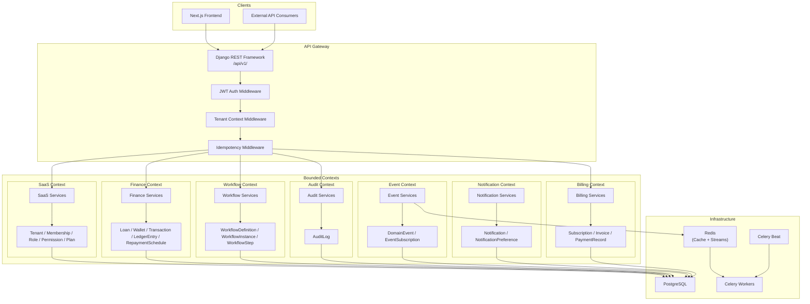

### 4.2 Multi-Tenancy Architecture

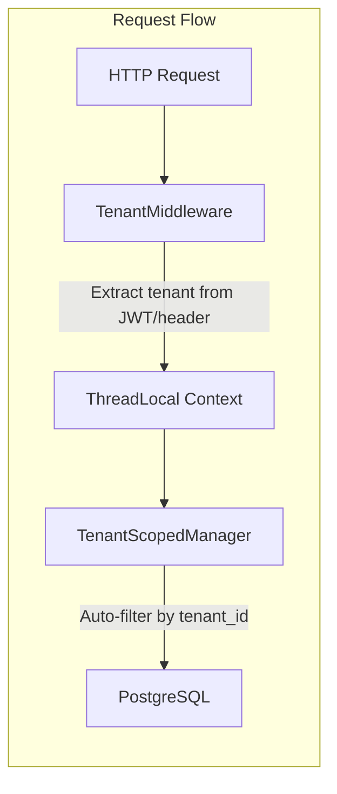

**Implementation**:
- Every tenant-scoped model inherits from `TenantScopedModel` (abstract base with `tenant` FK)
- Custom `TenantManager` overrides `get_queryset()` to auto-filter by current tenant
- `TenantMiddleware` extracts tenant from JWT claims and sets in `threading.local()`
- All queries automatically scoped — **no manual filtering needed in business logic**

### 4.3 Event Flow Architecture

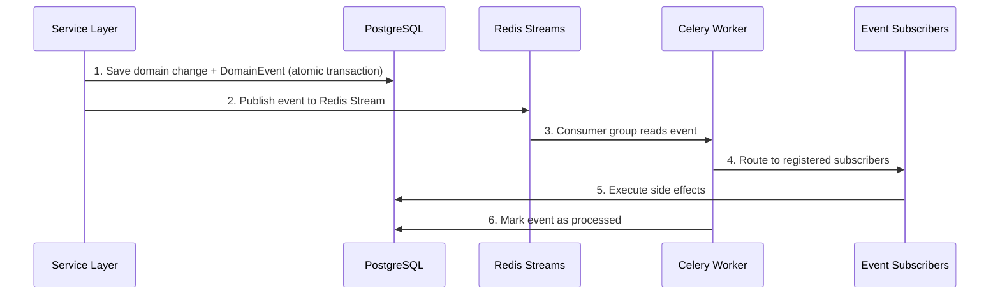

---

## 5. Domain Models

### 5.1 SaaS Context

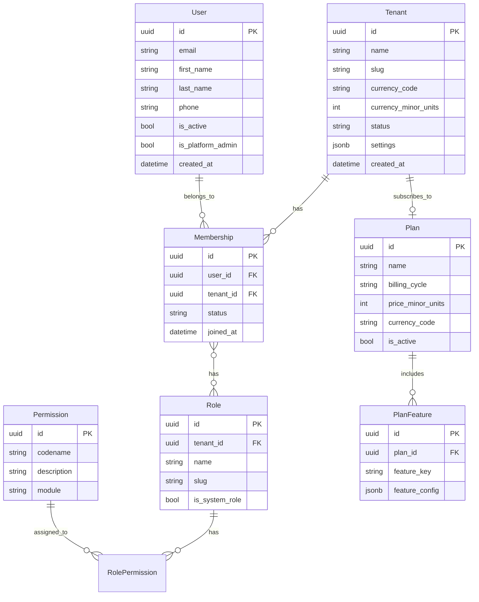

### 5.2 Finance Context

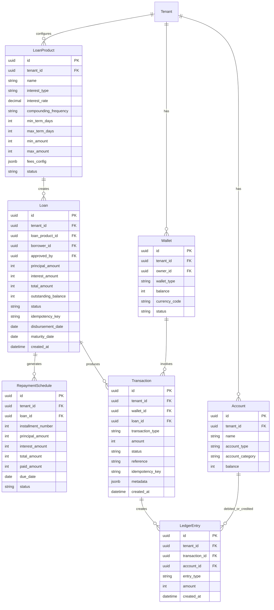

**Double-Entry Rules**:
- Every `Transaction` creates exactly 2+ `LedgerEntry` records
- Sum of all debits must equal sum of all credits per transaction
- `Account` types: ASSET, LIABILITY, EQUITY, REVENUE, EXPENSE
- Loan disbursement: DEBIT borrower wallet account, CREDIT loan receivable account

**Loan Status State Machine**:
```
CREATED → SUBMITTED → UNDER_REVIEW → APPROVED → DISBURSED → ACTIVE → COMPLETED
                                   ↘ REJECTED              ↘ DEFAULTED
                          ↗ RETURNED (back to SUBMITTED)
```

### 5.3 Workflow Context

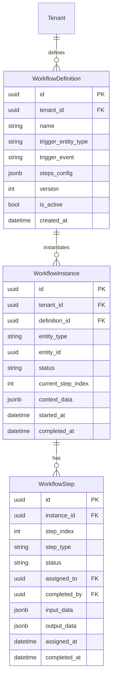

**`steps_config` JSON Schema** (example):
```json
{
  "steps": [
    {
      "index": 0,
      "name": "Manager Review",
      "type": "APPROVAL",
      "assignee_rule": {"type": "ROLE", "role": "branch_manager"},
      "actions": ["APPROVE", "REJECT", "RETURN"],
      "conditions": {"min_amount": 0, "max_amount": 100000}
    },
    {
      "index": 1,
      "name": "Director Approval",
      "type": "APPROVAL",
      "assignee_rule": {"type": "ROLE", "role": "director"},
      "actions": ["APPROVE", "REJECT"],
      "conditions": {"min_amount": 100001}
    },
    {
      "index": 2,
      "name": "Disbursement",
      "type": "ACTION",
      "action": "DISBURSE_LOAN",
      "auto_execute": true
    }
  ]
}
```

### 5.4 Audit Context

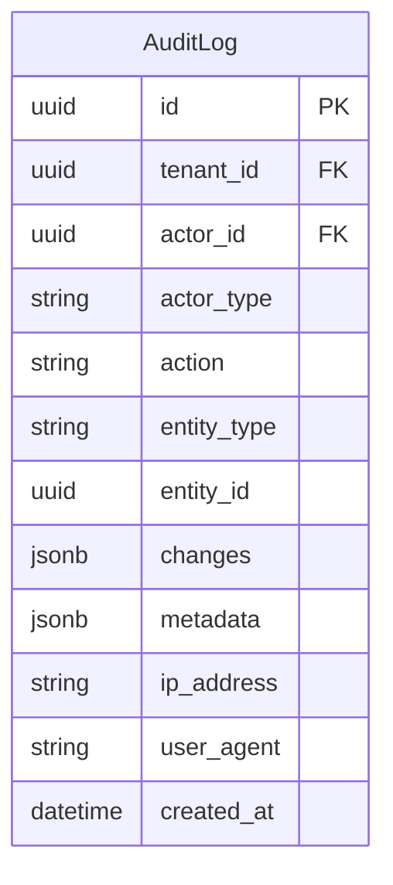

**Immutability**: AuditLog records are append-only. No UPDATE or DELETE operations permitted. Enforced at the model level (override `save()` to reject updates, override `delete()` to raise).

### 5.5 Event Context

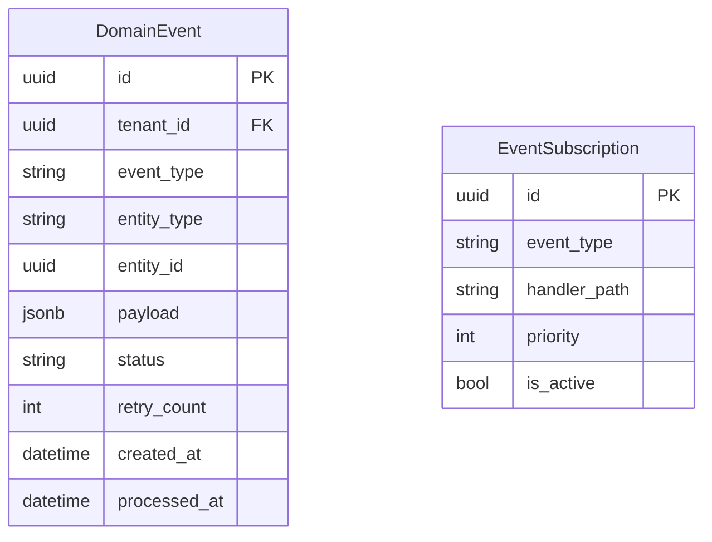

### 5.6 Notification Context

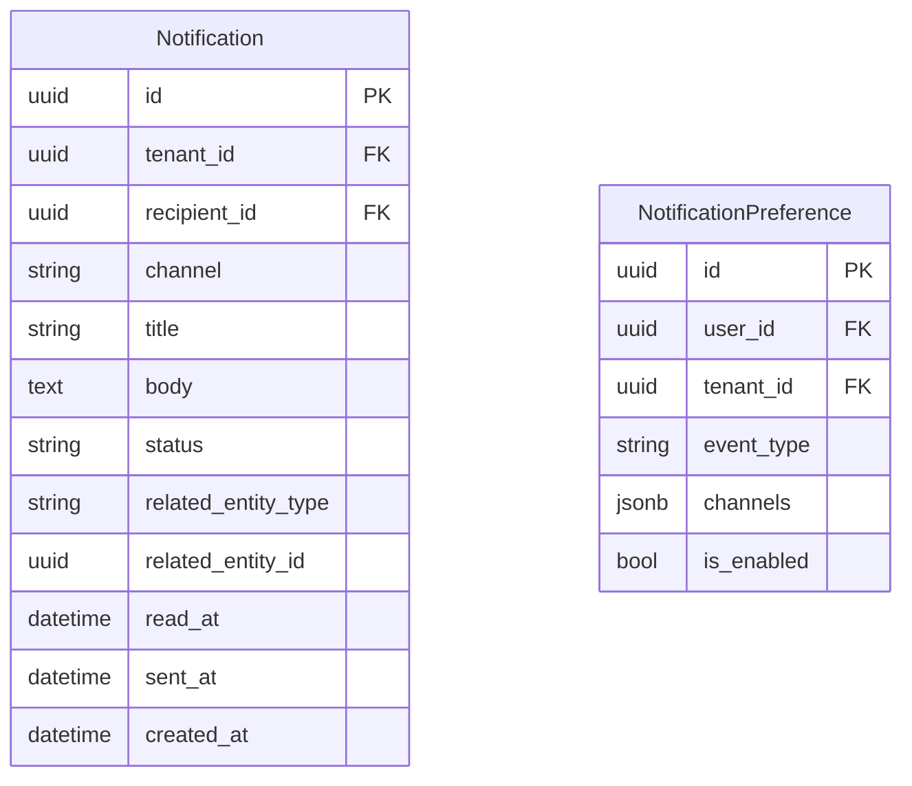

### 5.7 Billing Context

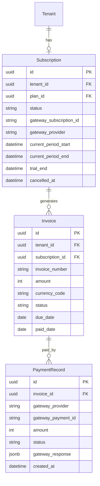

---

## 6. Project Structure

```
fincore/
├── config/                          # Django project config
│   ├── settings/
│   │   ├── base.py                  # Shared settings
│   │   ├── development.py           # Dev overrides
│   │   ├── production.py            # Prod overrides
│   │   └── testing.py               # Test overrides
│   ├── urls.py                      # Root URL config
│   ├── celery.py                    # Celery app config
│   ├── asgi.py
│   └── wsgi.py
│
├── core/                            # Shared kernel (cross-cutting)
│   ├── models.py                    # BaseModel, TenantScopedModel
│   ├── managers.py                  # TenantManager
│   ├── middleware/
│   │   ├── tenant.py                # TenantMiddleware
│   │   ├── idempotency.py           # IdempotencyMiddleware
│   │   └── audit.py                 # AuditMiddleware
│   ├── permissions.py               # DRF permission classes
│   ├── pagination.py                # Standard pagination
│   ├── exceptions.py                # Custom exception classes
│   ├── utils/
│   │   ├── money.py                 # Money/currency helpers
│   │   └── state_machine.py         # Generic state machine base
│   └── decorators/
│       ├── audit.py                 # @auditable decorator
│       └── idempotent.py            # @idempotent decorator
│
├── apps/
│   ├── saas/                        # SaaS Bounded Context
│   │   ├── models/
│   │   │   ├── tenant.py
│   │   │   ├── user.py
│   │   │   ├── membership.py
│   │   │   ├── role.py
│   │   │   └── permission.py
│   │   ├── services/
│   │   │   ├── tenant_service.py
│   │   │   ├── membership_service.py
│   │   │   └── rbac_service.py
│   │   ├── api/
│   │   │   ├── v1/
│   │   │   │   ├── serializers.py
│   │   │   │   ├── views.py
│   │   │   │   └── urls.py
│   │   ├── events.py                # Domain events for this context
│   │   ├── constants.py
│   │   └── tests/
│   │       ├── test_models.py
│   │       ├── test_services.py
│   │       └── test_api.py
│   │
│   ├── finance/                     # Finance Bounded Context
│   │   ├── models/
│   │   │   ├── loan_product.py
│   │   │   ├── loan.py
│   │   │   ├── wallet.py
│   │   │   ├── account.py
│   │   │   ├── transaction.py
│   │   │   ├── ledger_entry.py
│   │   │   └── repayment_schedule.py
│   │   ├── services/
│   │   │   ├── loan_service.py
│   │   │   ├── wallet_service.py
│   │   │   ├── ledger_service.py
│   │   │   ├── repayment_service.py
│   │   │   └── interest/
│   │   │       ├── base.py          # InterestCalculator protocol
│   │   │       ├── flat.py
│   │   │       ├── reducing.py
│   │   │       └── factory.py
│   │   ├── state_machines/
│   │   │   └── loan_state_machine.py
│   │   ├── api/
│   │   │   ├── v1/
│   │   │   │   ├── serializers.py
│   │   │   │   ├── views.py
│   │   │   │   └── urls.py
│   │   ├── events.py
│   │   ├── constants.py
│   │   └── tests/
│   │
│   ├── workflow/                    # Workflow Bounded Context
│   │   ├── models/
│   │   │   ├── definition.py
│   │   │   ├── instance.py
│   │   │   └── step.py
│   │   ├── services/
│   │   │   ├── workflow_service.py
│   │   │   └── engine.py            # Workflow execution engine
│   │   ├── api/
│   │   │   ├── v1/
│   │   │   │   ├── serializers.py
│   │   │   │   ├── views.py
│   │   │   │   └── urls.py
│   │   ├── events.py
│   │   └── tests/
│   │
│   ├── audit/                       # Audit Bounded Context
│   │   ├── models/
│   │   │   └── audit_log.py
│   │   ├── services/
│   │   │   └── audit_service.py
│   │   ├── api/
│   │   │   ├── v1/
│   │   │   │   ├── serializers.py
│   │   │   │   ├── views.py
│   │   │   │   └── urls.py
│   │   └── tests/
│   │
│   ├── events/                      # Event Bounded Context
│   │   ├── models/
│   │   │   ├── domain_event.py
│   │   │   └── subscription.py
│   │   ├── services/
│   │   │   ├── event_bus.py         # Redis Streams publisher
│   │   │   ├── event_consumer.py    # Consumer group processor
│   │   │   └── event_registry.py    # Handler registry
│   │   ├── tasks.py                 # Celery tasks
│   │   └── tests/
│   │
│   ├── notifications/               # Notification Bounded Context
│   │   ├── models/
│   │   │   ├── notification.py
│   │   │   └── preference.py
│   │   ├── services/
│   │   │   ├── notification_service.py
│   │   │   └── channels/
│   │   │       ├── base.py          # NotificationChannel protocol
│   │   │       ├── in_app.py
│   │   │       └── email.py
│   │   ├── api/
│   │   │   ├── v1/
│   │   │   │   ├── serializers.py
│   │   │   │   ├── views.py
│   │   │   │   └── urls.py
│   │   └── tests/
│   │
│   └── billing/                     # Billing Bounded Context
│       ├── models/
│       │   ├── subscription.py
│       │   ├── invoice.py
│       │   └── payment_record.py
│       ├── services/
│       │   ├── billing_service.py
│       │   └── gateways/
│       │       ├── base.py          # PaymentGateway protocol
│       │       ├── chapa.py
│       │       └── stripe.py        # Future
│       ├── api/
│       │   ├── v1/
│       │   │   ├── serializers.py
│       │   │   ├── views.py
│       │   │   └── urls.py
│       │   └── webhooks/
│       │       └── chapa.py         # Chapa webhook handler
│       └── tests/
│
├── docker/
│   ├── Dockerfile
│   └── docker-compose.yml
│
├── requirements/
│   ├── base.txt
│   ├── development.txt
│   ├── production.txt
│   └── testing.txt
│
├── manage.py
├── pytest.ini
├── .env.example
├── .gitignore
└── README.md
```

---

## 7. Core System Flows

### 7.1 Loan Lifecycle (End-to-End)

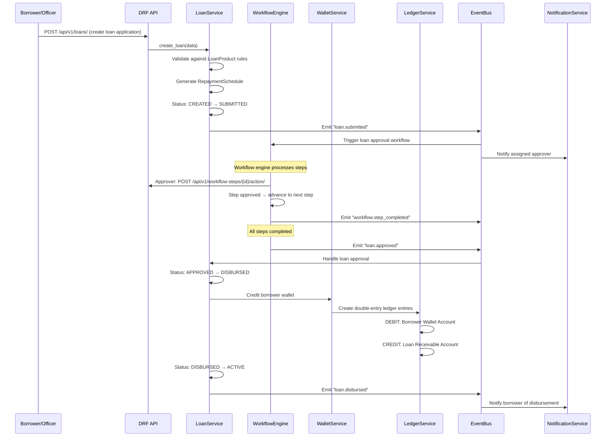

### 7.2 Repayment Flow

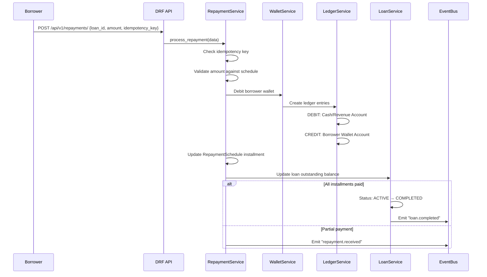

### 7.3 Tenant Onboarding Flow

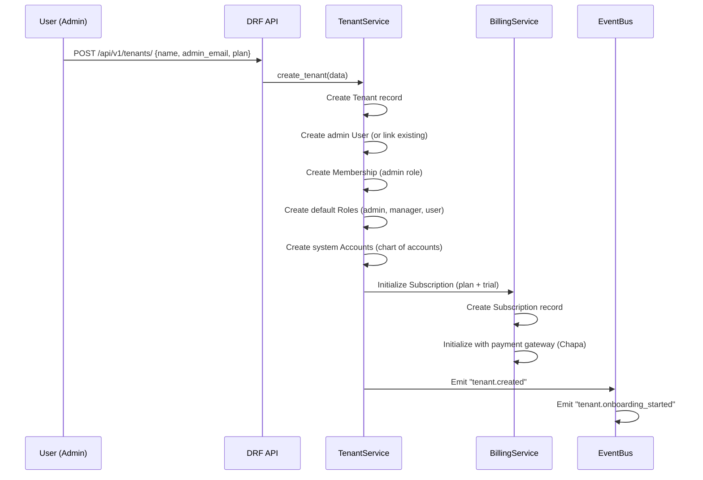

---

## 8. API Surface (Key Endpoints)

### 8.1 Authentication

| Method | Endpoint | Description |
|--------|----------|-------------|
| POST | `/api/v1/auth/login/` | Obtain JWT token pair |
| POST | `/api/v1/auth/refresh/` | Refresh access token |
| POST | `/api/v1/auth/register/` | User registration |
| GET | `/api/v1/auth/me/` | Current user profile |

### 8.2 SaaS Module

| Method | Endpoint | Description |
|--------|----------|-------------|
| POST | `/api/v1/tenants/` | Create tenant |
| GET | `/api/v1/tenants/` | List user's tenants |
| PATCH | `/api/v1/tenants/{id}/` | Update tenant settings |
| POST | `/api/v1/tenants/{id}/switch/` | Switch active tenant |
| GET | `/api/v1/members/` | List tenant members |
| POST | `/api/v1/members/invite/` | Invite member |
| GET | `/api/v1/roles/` | List tenant roles |
| POST | `/api/v1/roles/` | Create custom role |
| PATCH | `/api/v1/roles/{id}/permissions/` | Update role permissions |

### 8.3 Finance Module

| Method | Endpoint | Description |
|--------|----------|-------------|
| GET | `/api/v1/loan-products/` | List loan products |
| POST | `/api/v1/loan-products/` | Create loan product |
| GET | `/api/v1/loans/` | List loans |
| POST | `/api/v1/loans/` | Create loan application |
| GET | `/api/v1/loans/{id}/` | Loan detail |
| GET | `/api/v1/loans/{id}/schedule/` | Repayment schedule |
| POST | `/api/v1/repayments/` | Make repayment |
| GET | `/api/v1/wallets/` | List wallets |
| GET | `/api/v1/wallets/{id}/transactions/` | Wallet transactions |
| GET | `/api/v1/transactions/` | List transactions |
| GET | `/api/v1/ledger/` | Ledger entries |
| GET | `/api/v1/ledger/trial-balance/` | Trial balance report |

### 8.4 Workflow Module

| Method | Endpoint | Description |
|--------|----------|-------------|
| GET | `/api/v1/workflow-definitions/` | List workflow definitions |
| POST | `/api/v1/workflow-definitions/` | Create workflow definition |
| GET | `/api/v1/workflow-instances/` | List workflow instances |
| GET | `/api/v1/workflow-instances/{id}/` | Instance detail + steps |
| GET | `/api/v1/my-tasks/` | Tasks assigned to current user |
| POST | `/api/v1/workflow-steps/{id}/action/` | Perform step action |

### 8.5 Audit Module

| Method | Endpoint | Description |
|--------|----------|-------------|
| GET | `/api/v1/audit-logs/` | List audit logs (filterable) |
| GET | `/api/v1/audit-logs/entity/{type}/{id}/` | Entity history |

### 8.6 Notifications

| Method | Endpoint | Description |
|--------|----------|-------------|
| GET | `/api/v1/notifications/` | List user notifications |
| PATCH | `/api/v1/notifications/{id}/read/` | Mark as read |
| PATCH | `/api/v1/notifications/read-all/` | Mark all as read |
| GET | `/api/v1/notification-preferences/` | Get preferences |
| PATCH | `/api/v1/notification-preferences/` | Update preferences |

### 8.7 Billing

| Method | Endpoint | Description |
|--------|----------|-------------|
| GET | `/api/v1/subscription/` | Current subscription |
| POST | `/api/v1/subscription/change-plan/` | Change plan |
| GET | `/api/v1/invoices/` | List invoices |
| POST | `/api/v1/billing/checkout/` | Initialize payment |
| POST | `/api/v1/webhooks/chapa/` | Chapa webhook |

---

## 9. Cross-Cutting Concerns

### 9.1 Idempotency

```python
# Request
POST /api/v1/loans/
Idempotency-Key: "abc-123-unique"

# If key already processed → return cached response (200)
# If key new → process and store key + response
# Keys expire after 24 hours
```

### 9.2 Tenant Scoping (Automatic)

```python
# All tenant-scoped models use TenantManager
class TenantScopedModel(BaseModel):
    tenant = models.ForeignKey(Tenant, on_delete=models.CASCADE)
    objects = TenantManager()  # Auto-filters by current tenant

# In service code — no manual filtering needed:
loans = Loan.objects.filter(status='ACTIVE')  # Already tenant-scoped
```

### 9.3 Permission Checking

```python
# DRF permission class
class HasPermission:
    def __init__(self, codename):
        self.codename = codename
    
    def has_permission(self, request, view):
        return request.user.has_tenant_permission(
            tenant=request.tenant,
            codename=self.codename  # e.g., "loan:approve"
        )
```

### 9.4 Audit Decorator

```python
@auditable(action="LOAN_CREATED", entity_type="Loan")
def create_loan(self, data):
    # Business logic here
    # AuditLog entry created automatically with changes diff
    pass
```

---

## 10. Frontend Architecture (Phase 4 — High Level)

### 10.1 Folder Structure

```
frontend/
├── src/
│   ├── app/                         # Next.js App Router pages
│   │   ├── (auth)/                  # Auth pages (login, register)
│   │   ├── (dashboard)/             # Authenticated layout
│   │   │   ├── overview/
│   │   │   ├── loans/
│   │   │   ├── wallets/
│   │   │   ├── workflows/
│   │   │   ├── audit/
│   │   │   ├── settings/
│   │   │   └── billing/
│   │   └── layout.tsx
│   ├── features/                    # Feature modules
│   │   ├── auth/
│   │   ├── loans/
│   │   ├── wallets/
│   │   ├── workflows/
│   │   ├── audit/
│   │   ├── settings/
│   │   └── billing/
│   ├── shared/                      # Shared utilities
│   │   ├── api/                     # API client + hooks
│   │   ├── components/              # Reusable UI components
│   │   ├── hooks/
│   │   ├── stores/                  # Zustand stores
│   │   └── lib/                     # Utilities
│   └── styles/
├── public/
├── next.config.ts
├── tailwind.config.ts
└── tsconfig.json
```

### 10.2 Key Patterns

- **API layer**: Centralized API client with TanStack Query hooks per feature
- **Auth**: JWT stored in httpOnly cookies, refresh on 401
- **Tenant context**: Zustand store for active tenant, URL-scoped routes (`/t/{tenant_slug}/...`)
- **Role-based UI**: Components conditionally render based on user permissions
- **Forms**: React Hook Form + Zod schemas mirroring backend validation

---

## 11. Infrastructure (Docker Compose)

```yaml
# docker-compose.yml (dev)
services:
  web:
    build: .
    ports: ["8000:8000"]
    depends_on: [db, redis]
    env_file: .env
    volumes: [".:/app"]
    command: python manage.py runserver 0.0.0.0:8000

  db:
    image: postgres:16-alpine
    environment:
      POSTGRES_DB: fincore
      POSTGRES_USER: fincore
      POSTGRES_PASSWORD: fincore
    ports: ["5432:5432"]
    volumes: [pgdata:/var/lib/postgresql/data]

  redis:
    image: redis:7-alpine
    ports: ["6379:6379"]

  celery_worker:
    build: .
    command: celery -A config worker -l info
    depends_on: [db, redis]
    env_file: .env

  celery_beat:
    build: .
    command: celery -A config beat -l info
    depends_on: [db, redis]
    env_file: .env

volumes:
  pgdata:
```

---

## 12. Security Considerations

| Concern | Mitigation |
|---------|-----------|
| Cross-tenant data leakage | `TenantManager` auto-scoping on all queries. DB-level RLS as future enhancement. |
| JWT theft | Short-lived access tokens (15 min). Refresh rotation. Blacklist on logout. |
| SQL injection | Django ORM parameterized queries. No raw SQL without review. |
| Idempotency replay | Keys stored with response, expire after 24h. |
| Audit tampering | Append-only model. No UPDATE/DELETE on AuditLog. |
| Payment webhook forgery | Verify Chapa/Stripe webhook signatures. |
| Rate limiting | Django Ratelimit on auth + financial endpoints. |
| Sensitive data | Encrypt PII at rest. No financial amounts in logs. |

---
