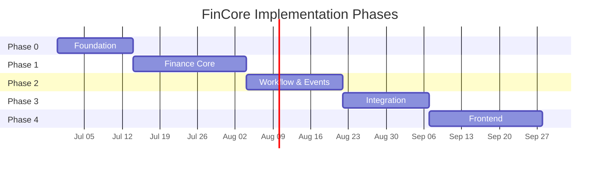
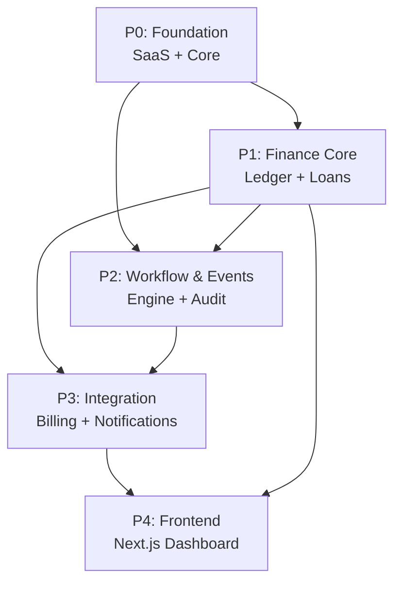

# FinCore — Implementation Plan

> **Version**: 1.0  
> **Date**: 2026-06-23  
> **Status**: Ready for Review  
> **Prerequisite**: [Architecture Document](file:///home/befikadusata/.gemini/antigravity-cli/brain/f72a0bb8-92c0-491d-9fa5-8d5d68698512/fincore_architecture.md)

---

## Phase Overview



| Phase | Name | Focus | Est. Duration |
|-------|------|-------|---------------|
| P0 | Foundation | Project setup, core infra, SaaS module | ~2 weeks |
| P1 | Finance Core | Double-entry ledger, loans, wallets, repayments | ~3 weeks |
| P2 | Workflow & Events | Event bus, workflow engine, audit system | ~2.5 weeks |
| P3 | Integration | Billing (Chapa), notifications, API hardening | ~2 weeks |
| P4 | Frontend | Next.js dashboard (architecture + core screens) | ~3 weeks |

**Total estimated**: ~12.5 weeks (solo developer pace)

---

## Phase Dependency Graph



> [!NOTE]
> P1 and P2 could partially overlap since event system and workflow engine don't strictly depend on all finance models being complete. However, sequential execution recommended for a solo developer.

---

## Phase 0: Foundation

> **Goal**: Bootable Django project with multi-tenant isolation, auth, and RBAC working end-to-end.

### Tasks

#### 0.1 Project Bootstrap
- [x] Initialize Django project with `config/` structure
- [x] Configure split settings (`base.py`, `development.py`, `production.py`, `testing.py`)
- [x] Set up `requirements/` (base, dev, prod, testing)
- [x] Create Docker Compose (Django + PostgreSQL 16 + Redis 7)
- [x] Configure Celery app in `config/celery.py`
- [x] Create `.env.example` with all required vars
- [x] Set up pytest + factory_boy + faker in `testing.txt`
- [x] Configure `pytest.ini` with Django settings

**Deliverable**: `docker-compose up` boots full stack. `pytest` runs green.

#### 0.2 Core Module (`core/`)
- [x] `BaseModel` — abstract model with `id` (UUID), `created_at`, `updated_at`
- [x] `TenantScopedModel` — extends BaseModel with `tenant` FK
- [x] `TenantManager` — custom manager with `get_queryset()` filtered by thread-local tenant
- [x] `TenantMiddleware` — extracts tenant from JWT claims, then header, then membership fallback
- [x] `IdempotencyMiddleware` — intercepts `Idempotency-Key` header, uses DB + cache
- [x] `IdempotencyRecord` model — stores key, response, expiry
- [x] Standard `pagination.py` (cursor-based for large datasets)
- [x] Custom `exceptions.py` (FinCoreError, TenantMismatchError, etc.)
- [x] `state_machine.py` utility (generic transitions + validation)
- [x] `money.py` utility (minor unit conversion, formatting)

**Deliverable**: All cross-cutting infrastructure reusable by all modules.

#### 0.3 SaaS Module (`apps/saas/`)
- [x] **Models**: `Tenant`, `User` (custom via `AbstractBaseUser`), `Membership`, `Role`, `Permission`, `RolePermission`, `Plan`, `PlanFeature`
- [x] **Custom User model** with email as username field
- [x] **Services**: `TenantService` (create, update, deactivate), `MembershipService` (invite, join, leave), `RBACService` (assign_role, remove_role, check_permission)
- [x] **API endpoints** (all under `/api/v1/`):
  - Auth: login, refresh, register, me
  - Tenants: CRUD, switch
  - Members: list, invite, remove
  - Roles: CRUD, assign_permissions, assign_members
- [x] **JWT configuration**: simplejwt with tenant_id in claims via `FinCoreTokenObtainPairSerializer`
- [x] **DRF permission classes**: `IsTenantMember`, `HasPermission` wired to MembershipViewSet + RoleViewSet
- [x] **Tests**: 12 new tests covering tenant creation, membership flow, RBAC, me, switch, remove, assign_permissions

**Deliverable**: Complete auth + multi-tenant SaaS foundation. A user can register, create a tenant, invite members, assign roles, and switch tenants.

#### 0.4 Tenant Isolation Verification
- [x] Write integration test: create 2 tenants, create data in each, verify queries from tenant A never return tenant B data
- [x] Test middleware correctly rejects requests without valid tenant context — 403 via IsTenantMember when no X-Tenant-ID or JWT tenant_id present
- [x] Test that `TenantManager` auto-scoping cannot be bypassed accidentally — `.unscoped()` is the intentional bypass, verified in tests

**Deliverable**: Proven tenant isolation with test coverage.

### P0 Definition of Done
- [x] Django project boots via Docker Compose
- [x] Custom User model with email auth
- [x] JWT auth working (login → access + refresh)
- [x] Multi-tenant isolation proven with tests
- [x] RBAC system functional — roles + permissions + assign_role/check_permission + wired to views
- [x] Idempotency middleware functional — DB-backed IdempotencyRecord + cache
- [x] All P0 tests passing (15 tests: auth, tenant creation, membership flow, RBAC, isolation)

---

## Phase 1: Finance Core

> **Goal**: Complete financial engine with double-entry ledger, loan lifecycle, and repayment processing.

### Tasks

#### 1.1 Chart of Accounts & Ledger (`apps/finance/`)
- [x] **Models**: `Account` (ASSET, LIABILITY, EQUITY, REVENUE, EXPENSE), `LedgerEntry` (debit/credit)
- [x] **LedgerService**:
  - `create_entry(debit_account, credit_account, amount, transaction)` — atomic double-entry
  - `validate_balance()` — assert total debits == total credits
  - `get_trial_balance(tenant)` — aggregated trial balance
- [x] **System accounts**: auto-create chart of accounts when tenant is created (Cash, Loan Receivable, Interest Revenue, Fee Revenue, etc.)
- [x] **Tests**: Double-entry balance invariant, trial balance accuracy

**Deliverable**: Ledger system that guarantees books always balance.

#### 1.2 Wallets
- [x] **Models**: `Wallet` (owner, type, balance, currency, status)
- [x] **WalletService**:
  - `create_wallet(owner, type)` — initialize with zero balance
  - `credit(wallet, amount, transaction)` — increase balance via ledger
  - `debit(wallet, amount, transaction)` — decrease balance via ledger (validate sufficient funds)
  - `get_balance(wallet)` — derived from ledger entries (not stored balance)
  - `freeze/unfreeze(wallet)` — status management
- [x] **Stored vs Calculated balance**: Store balance for performance, validate against ledger periodically
- [x] **Tests**: Credit/debit correctness, insufficient funds rejection, concurrent access safety

**Deliverable**: Wallet system backed by double-entry ledger.

#### 1.3 Loan Products
- [x] **Models**: `LoanProduct` (interest_type, rate, compounding, term limits, amount limits, fees_config)
- [x] **Interest calculation strategy**:
  - `InterestCalculator` protocol (abstract base)
  - `FlatInterestCalculator` — interest = principal × rate × term
  - `ReducingBalanceCalculator` — interest on remaining balance
  - `InterestCalculatorFactory` — returns calculator based on product config
- [x] **API**: CRUD for loan products (admin only)
- [x] **Tests**: Interest calculation accuracy for each strategy

**Deliverable**: Configurable loan products with pluggable interest calculation.

#### 1.4 Loan Lifecycle
- [x] **Models**: `Loan` (product, borrower, amounts, status, dates, idempotency_key)
- [x] **LoanStateMachine**: enforces valid transitions:
  ```
  CREATED → SUBMITTED → UNDER_REVIEW → APPROVED → DISBURSED → ACTIVE → COMPLETED
                                     ↘ REJECTED              ↘ DEFAULTED
  ```
- [x] **LoanService**:
  - `create_loan(data)` — validate against product rules, generate schedule
  - `submit_loan(loan)` — transition to SUBMITTED
  - `approve_loan(loan, approver)` — transition to APPROVED (permission check)
  - `disburse_loan(loan)` — credit borrower wallet, create ledger entries
  - `default_loan(loan)` — mark as DEFAULTED
- [x] **Transaction model**: `Transaction` (type, amount, status, reference, idempotency_key)
- [x] **API**: create, list, detail, schedule, submit, approve, disburse
- [x] **Tests**: Full lifecycle, invalid transitions rejected, idempotency on create

**Deliverable**: Complete loan lifecycle with state machine and ledger integration.

#### 1.5 Repayment Processing
- [x] **Models**: `RepaymentSchedule` (installment details, due date, status)
- [x] **RepaymentService**:
  - `generate_schedule(loan)` — create installment plan based on product config
  - `process_repayment(loan, amount, idempotency_key)` — validate, debit wallet, update schedule, update loan balance
  - `check_overdue()` — Celery beat task to flag overdue installments
  - `apply_penalty(installment)` — add penalty fee for overdue
- [x] **Partial payment handling**: allocate to oldest due installment first
- [x] **Tests**: Schedule generation accuracy, partial payment allocation, overdue detection

**Deliverable**: Repayment processing with schedule tracking and overdue management.

#### 1.6 Financial Reporting Endpoints
- [x] GET `/api/v1/finance/ledger/trial-balance/` — trial balance
- [x] GET `/api/v1/finance/loans/summary/` — loan portfolio summary (active, defaulted, completed, total outstanding)
- [x] GET `/api/v1/finance/wallets/{id}/statement/` — wallet statement with date range filter

**Deliverable**: Basic financial reporting API.

### P1 Definition of Done
- [x] Double-entry ledger with balance invariant
- [x] Wallet credit/debit via ledger
- [x] Loan products with configurable interest
- [x] Full loan lifecycle (create → complete/default)
- [x] Repayment schedule generation and processing
- [x] Financial reports (trial balance, portfolio summary)
- [x] Idempotency on financial write operations
- [x] All P1 tests passing

---

## Phase 2: Workflow & Events

> **Goal**: Event bus operational, workflow engine executing multi-step approvals, audit system capturing all actions.

### Tasks

#### 2.1 Event System (`apps/events/`)
- [x] **Models**: `DomainEvent` (type, entity, payload, status, retry_count), `EventSubscription` (type → handler mapping)
- [x] **EventBus service**:
  - `emit(event_type, entity_type, entity_id, payload)` — save event + publish to Redis Stream
  - `subscribe(event_type, handler_path)` — register handler
- [x] **Redis Streams integration**:
  - Producer: publishes to stream per event type
  - Consumer group: Celery workers consume from streams
  - Acknowledgment: mark event processed after successful handling
- [x] **Retry logic**: failed events retried with exponential backoff, max 5 retries, then dead-letter
- [x] **Event registry**: handler mapping loaded at startup
- [x] **Tests**: Event emission, consumption, retry on failure, idempotent handling

**Deliverable**: Reliable event bus with Redis Streams and Celery consumers.

#### 2.2 Workflow Engine (`apps/workflow/`)
- [x] **Models**: `WorkflowDefinition` (JSON config, version, trigger), `WorkflowInstance` (entity binding, status, current step), `WorkflowStep` (status, assignee, actions, timestamps)
- [x] **WorkflowService**:
  - `create_definition(config)` — validate JSON schema, store
  - `instantiate(definition, entity_type, entity_id)` — create instance + first step
  - `advance(instance)` — move to next step or complete
- [x] **WorkflowEngine**:
  - `execute_step(step, action, actor, data)` — process step action (APPROVE/REJECT/RETURN)
  - `evaluate_conditions(step_config, context)` — check if step applies
  - `assign_step(step, step_config)` — resolve assignee from role/user rule
  - `auto_execute(step)` — for automated steps (e.g., disbursement)
- [x] **Event integration**: workflow triggered by domain events (e.g., `loan.submitted` → start loan approval workflow)
- [x] **API**:
  - Definitions: CRUD
  - Instances: list, detail
  - My Tasks: inbox of pending steps for current user
  - Step Action: approve/reject/return with comments
- [x] **Tests**: Full workflow lifecycle, conditional step skipping, role-based assignment, rejection handling

**Deliverable**: Configurable workflow engine with event-triggered instantiation.

#### 2.3 Audit System (`apps/audit/`)
- [x] **Model**: `AuditLog` (immutable, append-only)
- [x] **AuditMiddleware**: captures request context (IP, user agent, user)
- [x] **`@auditable` decorator**: wraps service methods to auto-create audit entries with JSON diff of changes
- [x] **AuditService**:
  - `log(action, entity_type, entity_id, changes, actor)` — create audit entry
  - `get_entity_history(entity_type, entity_id)` — full history for an entity
- [x] **Immutability enforcement**: override `save()` to reject updates, override `delete()` to raise
- [x] **API**:
  - List audit logs (filterable by action, entity, actor, date range)
  - Entity history endpoint
- [x] **Tests**: Append-only enforcement, decorator captures changes, middleware captures context

**Deliverable**: Compliance-grade audit trail with entity-level history.

#### 2.4 Wire Finance → Events → Workflow
- [x] Connect `loan.submitted` event → triggers loan approval workflow
- [x] Connect `workflow.completed` event for loan → triggers `loan.approved` or `loan.rejected`
- [x] Connect `loan.approved` event → auto-disbursement step
- [x] Connect `repayment.received` event → notification trigger
- [x] Connect `loan.overdue` event → notification trigger

**Deliverable**: End-to-end flow from loan creation through approval workflow to disbursement, all event-driven.

### P2 Definition of Done
- [x] Event bus operational (emit → Redis Stream → consume → handle)
- [x] Workflow engine processes multi-step approvals
- [x] Audit system captures all mutating actions
- [x] Loan → Workflow → Disbursement flow working end-to-end
- [x] Retry and dead-letter for failed events
- [x] All P2 tests passing

---

## Phase 3: Integration

> **Goal**: Billing with Chapa, notification delivery, API hardening, security measures.

### Tasks

#### 3.1 Billing System (`apps/billing/`)
- [ ] **Models**: `Subscription`, `Invoice`, `PaymentRecord`
- [ ] **PaymentGateway protocol** (abstract interface):
  - `initialize_payment(amount, currency, callback_url)`
  - `verify_payment(reference)`
  - `create_subscription(plan, customer)`
  - `cancel_subscription(subscription_id)`
- [ ] **ChapaGateway** — implements PaymentGateway for Chapa API:
  - Initialize checkout
  - Verify transaction
  - Webhook signature validation
- [ ] **BillingService**:
  - `subscribe(tenant, plan)` — create subscription via gateway
  - `change_plan(tenant, new_plan)` — upgrade/downgrade
  - `process_webhook(payload)` — handle payment confirmation
  - `generate_invoice(subscription)` — periodic invoice generation
  - `check_subscription_status()` — Celery beat task
- [ ] **Webhook endpoint**: POST `/api/v1/webhooks/chapa/` with signature verification
- [ ] **Feature gating**: middleware checks tenant's plan features before allowing access
- [ ] **Tests**: Subscription lifecycle, webhook processing, feature gating

**Deliverable**: Working subscription billing with Chapa integration.

#### 3.2 Notification System (`apps/notifications/`)
- [ ] **Models**: `Notification`, `NotificationPreference`
- [ ] **NotificationChannel protocol** (abstract):
  - `send(recipient, title, body, metadata)`
- [ ] **InAppChannel** — save to DB
- [ ] **EmailChannel** — send via Django email backend (SMTP/SES)
- [ ] **NotificationService**:
  - `notify(user, event_type, title, body, entity)` — route to appropriate channels based on preferences
  - `mark_read(notification)` / `mark_all_read(user, tenant)`
- [ ] **Event subscribers**: connect to domain events:
  - `loan.approved` → notify borrower
  - `loan.disbursed` → notify borrower
  - `repayment.due_soon` → remind borrower (Celery beat, 3 days before due)
  - `workflow.step_assigned` → notify assignee
  - `subscription.payment_failed` → notify tenant admin
- [ ] **API**: list notifications, mark read, preferences CRUD
- [ ] **Tests**: Multi-channel delivery, preference filtering, event-triggered notifications

**Deliverable**: In-app + email notifications triggered by domain events.

#### 3.3 API Hardening
- [ ] Rate limiting on auth endpoints (5 requests/min)
- [ ] Rate limiting on financial write endpoints (30 requests/min)
- [ ] Request/response logging middleware (non-sensitive fields only)
- [ ] API documentation with drf-spectacular (OpenAPI 3.0 schema)
- [ ] CORS configuration for frontend domain
- [ ] Input validation hardening (max lengths, type checks on all serializers)

#### 3.4 Security Hardening
- [ ] JWT blacklist on logout
- [ ] Refresh token rotation (new refresh token on each use)
- [ ] Password policy enforcement (min length, complexity)
- [ ] Sensitive field encryption at rest (PII fields)
- [ ] Webhook signature verification (Chapa)
- [ ] Django security middleware (HSTS, X-Frame-Options, CSP)

### P3 Definition of Done
- [x] Chapa billing integration working (subscribe, pay, webhook)
- [x] Notifications delivered via in-app + email
- [x] Rate limiting active on critical endpoints
- [x] OpenAPI docs generated and accurate
- [x] Security hardening checklist complete
- [x] All P3 tests passing

---

## Phase 4: Frontend

> **Goal**: Production-grade Next.js dashboard consuming the backend API.

### Tasks

#### 4.1 Project Setup
- [ ] Initialize Next.js with App Router + TypeScript
- [ ] Configure Tailwind CSS
- [ ] Set up TanStack Query provider
- [ ] Set up Zustand stores (auth, tenant, UI)
- [ ] Create API client layer (axios instance with JWT interceptor, refresh logic)
- [ ] Set up Zod schemas mirroring backend validation
- [ ] Component library setup (buttons, inputs, modals, tables, cards)

#### 4.2 Auth UI
- [ ] Login page
- [ ] Registration page
- [ ] Password reset flow
- [ ] Auth middleware (redirect unauthenticated)
- [ ] JWT refresh interceptor (auto-refresh on 401)

#### 4.3 Tenant & SaaS UI
- [ ] Tenant switcher (workspace dropdown, like Slack)
- [ ] Create organization flow
- [ ] Organization settings page
- [ ] Member management (invite, remove, change role)
- [ ] Role management (create roles, assign permissions)

#### 4.4 Finance Dashboard
- [ ] Overview dashboard (KPIs: active loans, total disbursed, outstanding balance, overdue count)
- [ ] Loan products list + create form
- [ ] Loans list (filterable by status, date, borrower)
- [ ] Loan detail page (info, schedule, transactions, status timeline)
- [ ] Create loan application form
- [ ] Wallet list + detail (balance, transaction history)
- [ ] Repayment processing form
- [ ] Trial balance report view

#### 4.5 Workflow UI
- [ ] My Tasks inbox (pending approvals assigned to current user)
- [ ] Workflow step detail + action buttons (Approve / Reject / Return)
- [ ] Workflow instance timeline (visual step progression)
- [ ] Workflow definitions management (admin)

#### 4.6 Audit & Notifications UI
- [ ] Activity log page (filterable timeline)
- [ ] Entity history view (integrated into loan/wallet detail pages)
- [ ] Notification dropdown (bell icon with unread count)
- [ ] Notification preferences page

#### 4.7 Billing UI
- [ ] Subscription status page
- [ ] Plan comparison + upgrade flow
- [ ] Invoice history
- [ ] Chapa checkout integration

### P4 Definition of Done
- [x] All core screens functional
- [x] Auth flow complete (login, register, refresh, logout)
- [x] Tenant switching working
- [x] Loan lifecycle manageable through UI
- [x] Workflow approvals working through UI
- [x] Responsive on desktop + tablet
- [x] Role-based UI rendering (hide unauthorized actions)

---

## Risk Assessment

| Risk | Impact | Likelihood | Mitigation |
|------|--------|-----------|------------|
| Double-entry ledger bugs | **Critical** — financial incorrectness | Medium | Extensive unit tests, balance invariant checks, reconciliation job |
| Tenant data leakage | **Critical** — security breach | Low | Manager auto-scoping, integration tests, code review checklist |
| Event loss / duplicate processing | **High** — inconsistent state | Medium | Redis Streams acknowledgment, idempotent consumers, dead-letter queue |
| Workflow engine edge cases | **High** — stuck workflows | Medium | Timeout on steps, manual override API, comprehensive state tests |
| Chapa API instability | **Medium** — billing disruption | Medium | Retry with backoff, webhook idempotency, manual payment fallback |
| Scope creep | **Medium** — timeline slip | High | Strict phase boundaries, defer "nice-to-have" to post-P4 |

---

## Post-P4 Roadmap (Future Phases)

| Item | Description |
|------|-------------|
| Kafka migration | Replace Redis Streams with Kafka for higher throughput |
| Mobile app | React Native or Flutter companion app |
| Multi-currency | Support multiple currencies per tenant with exchange rates |
| Reporting engine | Advanced financial reports, PDF generation, scheduled reports |
| API keys | Tenant-scoped API keys for third-party integrations |
| Row-level security | PostgreSQL RLS as additional tenant isolation layer |
| SMS notifications | Integrate SMS provider (Africa's Talking, Twilio) |
| Savings products | Extend finance module beyond loans |
| Stripe adapter | PaymentGateway implementation for international billing |

---

> [!IMPORTANT]
> Review both documents. Approve this plan to begin implementation with **Phase 0: Foundation**.
