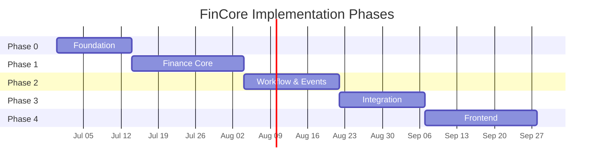
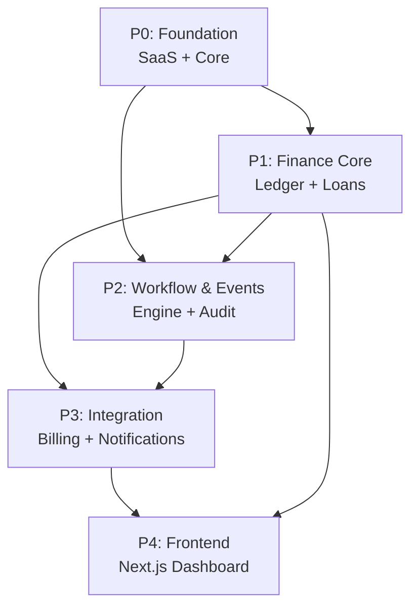

# FinCore — Implementation Plan

> **Version**: 1.0  
> **Date**: 2026-06-23  
> **Status**: Ready for Review  
> **Prerequisite**: [Architecture Document](file:///home/befikadusata/.gemini/antigravity-cli/brain/f72a0bb8-92c0-491d-9fa5-8d5d68698512/fincore_architecture.md)

---

## Phase Overview



| Phase | Name | Focus | Est. Duration |
|-------|------|-------|---------------|
| P0 | Foundation | Project setup, core infra, SaaS module | ~2 weeks |
| P1 | Finance Core | Double-entry ledger, loans, wallets, repayments | ~3 weeks |
| P2 | Workflow & Events | Event bus, workflow engine, audit system | ~2.5 weeks |
| P3 | Integration | Billing (Chapa), notifications, API hardening | ~2 weeks |
| P4 | Frontend | Next.js dashboard (architecture + core screens) | ~3 weeks |

**Total estimated**: ~12.5 weeks (solo developer pace)

---

## Phase Dependency Graph



> [!NOTE]
> P1 and P2 could partially overlap since event system and workflow engine don't strictly depend on all finance models being complete. However, sequential execution recommended for a solo developer.

---

## Phase 0: Foundation

> **Goal**: Bootable Django project with multi-tenant isolation, auth, and RBAC working end-to-end.

### Tasks

#### 0.1 Project Bootstrap
- [x] Initialize Django project with `config/` structure
- [x] Configure split settings (`base.py`, `development.py`, `production.py`, `testing.py`)
- [x] Set up `requirements/` (base, dev, prod, testing)
- [x] Create Docker Compose (Django + PostgreSQL 16 + Redis 7)
- [x] Configure Celery app in `config/celery.py`
- [x] Create `.env.example` with all required vars
- [x] Set up pytest + factory_boy + faker in `testing.txt`
- [x] Configure `pytest.ini` with Django settings

**Deliverable**: `docker-compose up` boots full stack. `pytest` runs green.

#### 0.2 Core Module (`core/`)
- [x] `BaseModel` — abstract model with `id` (UUID), `created_at`, `updated_at`
- [x] `TenantScopedModel` — extends BaseModel with `tenant` FK
- [x] `TenantManager` — custom manager with `get_queryset()` filtered by thread-local tenant
- [x] `TenantMiddleware` — extracts tenant from JWT claims, then header, then membership fallback
- [x] `IdempotencyMiddleware` — intercepts `Idempotency-Key` header, uses DB + cache
- [x] `IdempotencyRecord` model — stores key, response, expiry
- [x] Standard `pagination.py` (cursor-based for large datasets)
- [x] Custom `exceptions.py` (FinCoreError, TenantMismatchError, etc.)
- [x] `state_machine.py` utility (generic transitions + validation)
- [x] `money.py` utility (minor unit conversion, formatting)

**Deliverable**: All cross-cutting infrastructure reusable by all modules.

#### 0.3 SaaS Module (`apps/saas/`)
- [x] **Models**: `Tenant`, `User` (custom via `AbstractBaseUser`), `Membership`, `Role`, `Permission`, `RolePermission`, `Plan`, `PlanFeature`
- [x] **Custom User model** with email as username field
- [x] **Services**: `TenantService` (create, update, deactivate), `MembershipService` (invite, join, leave), `RBACService` (assign_role, remove_role, check_permission)
- [x] **API endpoints** (all under `/api/v1/`):
  - Auth: login, refresh, register, me
  - Tenants: CRUD, switch
  - Members: list, invite, remove
  - Roles: CRUD, assign_permissions, assign_members
- [x] **JWT configuration**: simplejwt with tenant_id in claims via `FinCoreTokenObtainPairSerializer`
- [x] **DRF permission classes**: `IsTenantMember`, `HasPermission` wired to MembershipViewSet + RoleViewSet
- [x] **Tests**: 12 new tests covering tenant creation, membership flow, RBAC, me, switch, remove, assign_permissions

**Deliverable**: Complete auth + multi-tenant SaaS foundation. A user can register, create a tenant, invite members, assign roles, and switch tenants.

#### 0.4 Tenant Isolation Verification
- [x] Write integration test: create 2 tenants, create data in each, verify queries from tenant A never return tenant B data
- [x] Test middleware correctly rejects requests without valid tenant context — 403 via IsTenantMember when no X-Tenant-ID or JWT tenant_id present
- [x] Test that `TenantManager` auto-scoping cannot be bypassed accidentally — `.unscoped()` is the intentional bypass, verified in tests

**Deliverable**: Proven tenant isolation with test coverage.

### P0 Definition of Done
- [x] Django project boots via Docker Compose
- [x] Custom User model with email auth
- [x] JWT auth working (login → access + refresh)
- [x] Multi-tenant isolation proven with tests
- [x] RBAC system functional — roles + permissions + assign_role/check_permission + wired to views
- [x] Idempotency middleware functional — DB-backed IdempotencyRecord + cache
- [x] All P0 tests passing (15 tests: auth, tenant creation, membership flow, RBAC, isolation)

---

## Phase 1: Finance Core

> **Goal**: Complete financial engine with double-entry ledger, loan lifecycle, and repayment processing.

### Tasks

#### 1.1 Chart of Accounts & Ledger (`apps/finance/`)
- [x] **Models**: `Account` (ASSET, LIABILITY, EQUITY, REVENUE, EXPENSE), `LedgerEntry` (debit/credit)
- [x] **LedgerService**:
  - `create_entry(debit_account, credit_account, amount, transaction)` — atomic double-entry
  - `validate_balance()` — assert total debits == total credits
  - `get_trial_balance(tenant)` — aggregated trial balance
- [x] **System accounts**: auto-create chart of accounts when tenant is created (Cash, Loan Receivable, Interest Revenue, Fee Revenue, etc.)
- [x] **Tests**: Double-entry balance invariant, trial balance accuracy

**Deliverable**: Ledger system that guarantees books always balance.

#### 1.2 Wallets
- [x] **Models**: `Wallet` (owner, type, balance, currency, status)
- [x] **WalletService**:
  - `create_wallet(owner, type)` — initialize with zero balance
  - `credit(wallet, amount, transaction)` — increase balance via ledger
  - `debit(wallet, amount, transaction)` — decrease balance via ledger (validate sufficient funds)
  - `get_balance(wallet)` — derived from ledger entries (not stored balance)
  - `freeze/unfreeze(wallet)` — status management
- [x] **Stored vs Calculated balance**: Store balance for performance, validate against ledger periodically
- [x] **Tests**: Credit/debit correctness, insufficient funds rejection, concurrent access safety

**Deliverable**: Wallet system backed by double-entry ledger.

#### 1.3 Loan Products
- [x] **Models**: `LoanProduct` (interest_type, rate, compounding, term limits, amount limits, fees_config)
- [x] **Interest calculation strategy**:
  - `InterestCalculator` protocol (abstract base)
  - `FlatInterestCalculator` — interest = principal × rate × term
  - `ReducingBalanceCalculator` — interest on remaining balance
  - `InterestCalculatorFactory` — returns calculator based on product config
- [x] **API**: CRUD for loan products (admin only)
- [x] **Tests**: Interest calculation accuracy for each strategy

**Deliverable**: Configurable loan products with pluggable interest calculation.

#### 1.4 Loan Lifecycle
- [x] **Models**: `Loan` (product, borrower, amounts, status, dates, idempotency_key)
- [x] **LoanStateMachine**: enforces valid transitions:
  ```
  CREATED → SUBMITTED → UNDER_REVIEW → APPROVED → DISBURSED → ACTIVE → COMPLETED
                                     ↘ REJECTED              ↘ DEFAULTED
  ```
- [x] **LoanService**:
  - `create_loan(data)` — validate against product rules, generate schedule
  - `submit_loan(loan)` — transition to SUBMITTED
  - `approve_loan(loan, approver)` — transition to APPROVED (permission check)
  - `disburse_loan(loan)` — credit borrower wallet, create ledger entries
  - `default_loan(loan)` — mark as DEFAULTED
- [x] **Transaction model**: `Transaction` (type, amount, status, reference, idempotency_key)
- [x] **API**: create, list, detail, schedule, submit, approve, disburse
- [x] **Tests**: Full lifecycle, invalid transitions rejected, idempotency on create

**Deliverable**: Complete loan lifecycle with state machine and ledger integration.

#### 1.5 Repayment Processing
- [x] **Models**: `RepaymentSchedule` (installment details, due date, status)
- [x] **RepaymentService**:
  - `generate_schedule(loan)` — create installment plan based on product config
  - `process_repayment(loan, amount, idempotency_key)` — validate, debit wallet, update schedule, update loan balance
  - `check_overdue()` — Celery beat task to flag overdue installments
  - `apply_penalty(installment)` — add penalty fee for overdue
- [x] **Partial payment handling**: allocate to oldest due installment first
- [x] **Tests**: Schedule generation accuracy, partial payment allocation, overdue detection

**Deliverable**: Repayment processing with schedule tracking and overdue management.

#### 1.6 Financial Reporting Endpoints
- [x] GET `/api/v1/finance/ledger/trial-balance/` — trial balance
- [x] GET `/api/v1/finance/loans/summary/` — loan portfolio summary (active, defaulted, completed, total outstanding)
- [x] GET `/api/v1/finance/wallets/{id}/statement/` — wallet statement with date range filter

**Deliverable**: Basic financial reporting API.

### P1 Definition of Done
- [x] Double-entry ledger with balance invariant
- [x] Wallet credit/debit via ledger
- [x] Loan products with configurable interest
- [x] Full loan lifecycle (create → complete/default)
- [x] Repayment schedule generation and processing
- [x] Financial reports (trial balance, portfolio summary)
- [x] Idempotency on financial write operations
- [x] All P1 tests passing

---

## Phase 2: Workflow & Events

> **Goal**: Event bus operational, workflow engine executing multi-step approvals, audit system capturing all actions.

### Tasks

#### 2.1 Event System (`apps/events/`)
- [x] **Models**: `DomainEvent` (type, entity, payload, status, retry_count), `EventSubscription` (type → handler mapping)
- [x] **EventBus service**:
  - `emit(event_type, entity_type, entity_id, payload)` — save event + publish to Redis Stream
  - `subscribe(event_type, handler_path)` — register handler
- [x] **Redis Streams integration**:
  - Producer: publishes to stream per event type
  - Consumer group: Celery workers consume from streams
  - Acknowledgment: mark event processed after successful handling
- [x] **Retry logic**: failed events retried with exponential backoff, max 5 retries, then dead-letter
- [x] **Event registry**: handler mapping loaded at startup
- [x] **Tests**: Event emission, consumption, retry on failure, idempotent handling

**Deliverable**: Reliable event bus with Redis Streams and Celery consumers.

#### 2.2 Workflow Engine (`apps/workflow/`)
- [x] **Models**: `WorkflowDefinition` (JSON config, version, trigger), `WorkflowInstance` (entity binding, status, current step), `WorkflowStep` (status, assignee, actions, timestamps)
- [x] **WorkflowService**:
  - `create_definition(config)` — validate JSON schema, store
  - `instantiate(definition, entity_type, entity_id)` — create instance + first step
  - `advance(instance)` — move to next step or complete
- [x] **WorkflowEngine**:
  - `execute_step(step, action, actor, data)` — process step action (APPROVE/REJECT/RETURN)
  - `evaluate_conditions(step_config, context)` — check if step applies
  - `assign_step(step, step_config)` — resolve assignee from role/user rule
  - `auto_execute(step)` — for automated steps (e.g., disbursement)
- [x] **Event integration**: workflow triggered by domain events (e.g., `loan.submitted` → start loan approval workflow)
- [x] **API**:
  - Definitions: CRUD
  - Instances: list, detail
  - My Tasks: inbox of pending steps for current user
  - Step Action: approve/reject/return with comments
- [x] **Tests**: Full workflow lifecycle, conditional step skipping, role-based assignment, rejection handling

**Deliverable**: Configurable workflow engine with event-triggered instantiation.

#### 2.3 Audit System (`apps/audit/`)
- [x] **Model**: `AuditLog` (immutable, append-only)
- [x] **AuditMiddleware**: captures request context (IP, user agent, user)
- [x] **`@auditable` decorator**: wraps service methods to auto-create audit entries with JSON diff of changes
- [x] **AuditService**:
  - `log(action, entity_type, entity_id, changes, actor)` — create audit entry
  - `get_entity_history(entity_type, entity_id)` — full history for an entity
- [x] **Immutability enforcement**: override `save()` to reject updates, override `delete()` to raise
- [x] **API**:
  - List audit logs (filterable by action, entity, actor, date range)
  - Entity history endpoint
- [x] **Tests**: Append-only enforcement, decorator captures changes, middleware captures context

**Deliverable**: Compliance-grade audit trail with entity-level history.

#### 2.4 Wire Finance → Events → Workflow
- [x] Connect `loan.submitted` event → triggers loan approval workflow
- [x] Connect `workflow.completed` event for loan → triggers `loan.approved` or `loan.rejected`
- [x] Connect `loan.approved` event → auto-disbursement step
- [x] Connect `repayment.received` event → notification trigger
- [x] Connect `loan.overdue` event → notification trigger

**Deliverable**: End-to-end flow from loan creation through approval workflow to disbursement, all event-driven.

### P2 Definition of Done
- [x] Event bus operational (emit → Redis Stream → consume → handle)
- [x] Workflow engine processes multi-step approvals
- [x] Audit system captures all mutating actions
- [x] Loan → Workflow → Disbursement flow working end-to-end
- [x] Retry and dead-letter for failed events
- [x] All P2 tests passing

---

## Phase 3: Integration

> **Goal**: Billing with Chapa, notification delivery, API hardening, security measures.

### Tasks

#### 3.1 Billing System (`apps/billing/`)
- [x] **Models**: `Subscription`, `Invoice`, `PaymentRecord`
- [x] **PaymentGateway protocol** (abstract interface):
  - `initialize_payment(amount, currency, callback_url)`
  - `verify_payment(reference)`
  - `create_subscription(plan, customer)`
  - `cancel_subscription(subscription_id)`
- [x] **ChapaGateway** — implements PaymentGateway for Chapa API:
  - Initialize checkout
  - Verify transaction
  - Webhook signature validation
- [x] **BillingService**:
  - `subscribe(tenant, plan)` — create subscription via gateway
  - `change_plan(tenant, new_plan)` — upgrade/downgrade
  - `process_webhook(payload)` — handle payment confirmation
  - `generate_invoice(subscription)` — periodic invoice generation
  - `check_subscription_status()` — Celery beat task
- [x] **Webhook endpoint**: POST `/api/v1/webhooks/chapa/` with signature verification
- [x] **Feature gating**: middleware checks tenant's plan features before allowing access
- [x] **Tests**: Subscription lifecycle, webhook processing, feature gating

**Deliverable**: Working subscription billing with Chapa integration.

#### 3.2 Notification System (`apps/notifications/`)
- [x] **Models**: `Notification`, `NotificationPreference`
- [x] **NotificationChannel protocol** (abstract):
  - `send(recipient, title, body, metadata)`
- [x] **InAppChannel** — save to DB
- [x] **EmailChannel** — send via Django email backend (SMTP/SES)
- [x] **NotificationService**:
  - `notify(user, event_type, title, body, entity)` — route to appropriate channels based on preferences
  - `mark_read(notification)` / `mark_all_read(user, tenant)`
- [x] **Event subscribers**: connect to domain events:
  - `loan.approved` → notify borrower
  - `loan.disbursed` → notify borrower
  - `repayment.due_soon` → remind borrower (Celery beat, 3 days before due)
  - `workflow.step_assigned` → notify assignee
  - `subscription.payment_failed` → notify tenant admin
- [x] **API**: list notifications, mark read, preferences CRUD
- [x] **Tests**: Multi-channel delivery, preference filtering, event-triggered notifications

**Deliverable**: In-app + email notifications triggered by domain events.

#### 3.3 API Hardening
- [x] Rate limiting on auth endpoints (5 requests/min)
- [x] Rate limiting on financial write endpoints (30 requests/min)
- [x] Request/response logging middleware (non-sensitive fields only)
- [x] API documentation with drf-spectacular (OpenAPI 3.0 schema)
- [x] CORS configuration for frontend domain
- [x] Input validation hardening (max lengths, type checks on all serializers)

#### 3.4 Security Hardening
- [x] JWT blacklist on logout
- [x] Refresh token rotation (new refresh token on each use)
- [x] Password policy enforcement (min length, complexity)
- [x] Sensitive field encryption at rest (PII fields)
- [x] Webhook signature verification (Chapa)
- [x] Django security middleware (HSTS, X-Frame-Options, CSP)

### P3 Definition of Done
- [x] Chapa billing integration working (subscribe, pay, webhook)
- [x] Notifications delivered via in-app + email
- [x] Rate limiting active on critical endpoints
- [x] OpenAPI docs generated and accurate
- [x] Security hardening checklist complete
- [x] All P3 tests passing

---

## Phase 4: Frontend

> **Goal**: Production-grade Next.js dashboard consuming the backend API.

> [!IMPORTANT]
> **Design System**: All frontend work is governed by [`docs/ui_design_system.md`](./ui_design_system.md) (v1.0). That document is the single source of truth for tokens, typography, components, and patterns. Do not hard-code hex values, font sizes, or spacing in components — always reference a semantic token or a utility from `lib/format.ts` / `lib/status.ts`.
>
> **Stack**: Next.js App Router + TypeScript + Tailwind CSS + CSS Variables
>
> **Three cross-cutting rules for every screen:**
> 1. **Status Rail** — 3px left border on every entity card and table row, colour driven by entity status
> 2. **Mono font for numbers** — all currency amounts, IDs, dates, and rates use `font-mono` via `AmountDisplay` or `formatAmount()`; never `font-sans` for numeric data
> 3. **Status colours** — always derive from `loanStatusVariant(status)` (`lib/status.ts`) + §3.4 mapping; never hard-code a colour for a status

### Tasks

#### 4.0 Design System Foundation

> **Complete before any screen work.** All UI and domain components must be built and exported before tasks 4.1–4.7 begin.

**Token layer** (`src/styles/tokens/` — design system §7):
- [x] `base.css` — raw values: hex, px, rem, ms (design system §3.1, §4.1, §5.1–5.2)
- [x] `semantic.css` — light mode semantic tokens (design system §3.2)
- [x] `semantic.dark.css` — `[data-theme="dark"]` overrides (design system §3.3)
- [x] `index.css` — `@import` of all three token files
- [x] `globals.css` — CSS reset + body defaults, imports `index.css`

**Tailwind config** (via `@theme inline` in `globals.css` — Tailwind v4 CSS-first config):
- [x] CSS variable bridge — `bg-surface`, `bg-page`, `bg-sunken`, `text-primary`, `text-secondary`, `text-tertiary`, `text-inverse`, `text-brand`, `border-border`, `border-strong`, `brand`, `brand-subtle`
- [x] Font families: `Inter` (sans), `JetBrains Mono` (mono) — loaded via `next/font/google`
- [x] Font sizes + line heights matching design system §4.3
- [x] Spacing scale from design system §5.1
- [x] Border radius, box shadows, transition durations from design system §5.2
- [x] Dark mode selector: `@custom-variant dark` with `[data-theme="dark"]`

**Dark mode** (`lib/theme.ts` + `app/layout.tsx` — design system §8.2):
- [x] `setTheme(theme)` / `initTheme()` — reads `localStorage`, falls back to `prefers-color-scheme`
- [x] Inline `<script>` in `<head>` to apply theme before first paint (no flash)

**UI component library** (`src/components/ui/` — design system §6):
- [x] `Button.tsx` — variants: primary, secondary, danger, ghost; sizes: sm, md, lg; loading state (spinner + "Processing…" label, disabled)
- [x] `Input.tsx` — base input + `InputAmount` variant (mono font, right-aligned, currency prefix slot)
- [x] `Badge.tsx` — variants: success, info, warning, danger, neutral, purple; optional dot element
- [x] `Card.tsx` — base card + KPI variant; Status Rail support via `statusRail` prop mapped to `card-status-rail status-{variant}` classes
- [x] `Modal.tsx` — sizes: sm (400px), md (560px), lg (720px); sticky header + footer; Headless UI `Dialog` for focus trap + Escape close
- [x] `Drawer.tsx` — right-side, `min(560px, 100vw)`; flex column with scrollable body; same Headless UI `Dialog` base as Modal
- [x] `Table.tsx` — `col-amount` (mono right), `col-id` (mono sm secondary), `col-date` (mono sm secondary); status rail on rows via `statusRail` row prop; `TableToolbar` sub-component (search + filter slots)
- [x] `Tabs.tsx` — brand amber underline on active tab; `margin-bottom: -1px` flush with container border
- [x] `Toast.tsx` — four variants (success, error, warning, info) each with 3px left rail; `ToastRegion` fixed bottom-right stacked container
- [x] `EmptyState.tsx` — centered icon + title (xl semibold) + description (base secondary, max-w 360px) + optional action slot
- [x] `index.ts` — barrel export of all components above

**Domain components** (`src/components/domain/` — design system §7):
- [x] `LoanStatusBadge.tsx` — wraps `Badge` with `loanStatusVariant(status)` from `lib/status.ts`; accepts raw `status` string
- [x] `AmountDisplay.tsx` — mono font, semibold, currency prefix (default `ETB`), calls `formatAmount()` from `lib/format.ts`; size prop maps to `text-md` through `text-3xl`
- [x] `KPICard.tsx` — label (`text-sm secondary`) / amount (`text-3xl font-mono font-bold`) / delta line (`text-sm success-text` or `warning-text`) layout
- [x] `LoanTimeline.tsx` — horizontal step strip; steps derived from loan state machine order; current step highlighted with brand amber; completed steps muted; rejected/defaulted in danger colour
- [x] `RepaymentSchedule.tsx` — `Table` of installments with: #, due date (`col-date`), principal (`col-amount`), interest (`col-amount`), total (`col-amount`), `LoanStatusBadge` for installment status
- [x] `WorkflowStepCard.tsx` — unread dot, step type label, entity ID (`col-id`), borrower name, `AmountDisplay`, elapsed time (`formatDate`), primary action button

**Utility libraries** (`src/lib/` — design system §11.1–11.2):
- [x] `lib/format.ts` — `formatAmount(amount: number, currency?: string, locale?: string): string` (amounts stored in minor units ÷ 100); `formatLoanId(id: string): string` → `LN-XXXXXXXX`; `formatDate(date: string): string` → `DD Mon YYYY`
- [x] `lib/status.ts` — `type BadgeVariant = 'success' | 'info' | 'warning' | 'danger' | 'neutral' | 'purple'`; `loanStatusVariant(status: string): BadgeVariant` using the ten-status mapping from design system §3.4

**Deliverable**: Token layer active in browser (light + dark), Tailwind config wired, all 10 UI components + 6 domain components exported from their respective `index.ts` files, format and status utils tested.

---

#### 4.1 Project Setup
- [x] Initialize Next.js with App Router + TypeScript (design system token + Tailwind work goes in 4.0, not here)
- [x] Configure Tailwind CSS — base config only; CSS variable bridge is part of Task 4.0
- [x] Set up TanStack Query provider (`QueryClientProvider` in `app/providers.tsx`)
- [x] Set up Zustand stores: `auth` (user, tokens), `tenant` (active tenant, list), `ui` (sidebar open, `theme: 'light' | 'dark'`, `setTheme()`)
- [x] Create API client (`src/lib/api.ts`) — axios instance with `NEXT_PUBLIC_API_URL` base URL; request interceptor attaches `Authorization: Bearer <access>`; response interceptor auto-refreshes on 401 using `/api/v1/auth/token/refresh/` then retries original request
- [x] Set up Zod schemas in `src/lib/schemas/` mirroring backend serializer validations (loan, repayment, member invite, role)

#### 4.2 Auth UI
- [x] Login page — `Card` (centered, max-w 400px) wrapping `Input` (email + password with error state), `Button` (primary, full-width, loading state on submit)
- [x] Registration page — same card pattern; all form fields use `field` / `field-label` / `field-label-required` / `field-error` / `field-hint` structure from design system §6.2; amber focus ring is automatic via `--color-border-focus`
- [x] Password reset flow — request email page + reset-with-token page; same card layout
- [x] Auth middleware (`middleware.ts`) — checks `access_token` cookie; redirects unauthenticated requests to `/login`; redirects authenticated `/login` to `/dashboard`
- [x] JWT refresh interceptor — handled in API client (see 4.1); clears auth store + redirects to `/login` if refresh also fails

#### 4.3 Tenant & SaaS UI
- [x] Tenant switcher — in sidebar logo area (design system §6.7): `FinCore` wordmark + `[Tenant Name ▾]` using Headless UI `Menu`; switching calls `/api/v1/tenants/switch/` and updates auth store
- [x] Create organization flow — multi-step `Modal` (modal-md): org name → confirm; calls tenant create endpoint
- [x] Organization settings page — `Tabs` (Profile / Members / Roles / Billing); each tab is a scrollable `Card` section
- [x] Member management — member list as `Table` with role `Badge` (neutral) per member; invite via `Modal` (modal-md): email `Input` + role `Select` + `Button` (primary: Invite); remove via `btn-danger` + confirmation `Modal`
- [x] Role management — list of `Card` components, one per role; permissions displayed as `Badge-neutral` chips; create/edit role in `Modal` (modal-lg)

#### 4.4 Finance Dashboard
- [x] **Overview dashboard** — 3–4 column KPI grid using `KPICard` domain component; metrics: Active Loans, Total Disbursed, Outstanding Balance, Overdue Count; amounts in `text-3xl font-mono font-bold`; positive deltas in `color-success-text`, negative in `color-warning-text`
- [x] **Loan products** — list as `Table`; create/edit in `Modal` (modal-lg) with interest type `Select` + amount limit fields using `InputAmount`
- [x] **Loans list** — `Table` with Status Rail on rows (`status-rail-active`, `status-rail-overdue`, `status-rail-danger`); columns: Loan ID (`col-id`), Borrower (sans), Amount (`col-amount`), `LoanStatusBadge`, Due Date (`col-date`); `TableToolbar` with search `Input` + Status `Select` + Date range; `EmptyState` copy: "No loans yet. Create a loan product, then submit your first application."
- [x] **Loan detail** — right `Drawer` (560px); `LoanStatusBadge` + `LoanTimeline` at top; `Tabs`: Info / Schedule / Transactions / History; Schedule tab: `RepaymentSchedule` component; History tab: audit entries from entity history endpoint
- [x] **Create loan application** — `Modal` (modal-lg); principal field uses `InputAmount` with ETB prefix following design system §6.2 currency pattern; product `Select` auto-fills term + rate fields
- [x] **Wallet list + detail** — wallet list as `Card` grid; detail `Drawer` with balance as `text-3xl font-mono` + `Table` of transactions using `AmountDisplay` for amounts
- [x] **Repayment form** — `Modal` (modal-md) with `InputAmount` for payment amount; shows schedule summary
- [x] **Trial balance report** — `Table` with account name (sans) + debit/credit columns (`col-amount` right-aligned mono); totals row in `font-bold`
- [x] All amounts: `AmountDisplay` component or `formatAmount()` — never raw numbers. All loan IDs: `formatLoanId()`. All dates: `formatDate()`.

#### 4.5 Workflow UI
- [x] **My Tasks inbox** — list of `WorkflowStepCard` components following design system §11.5 inbox pattern; unread dot (●) on unopened items; shows: step type, `formatLoanId()`, borrower name, `AmountDisplay`, `formatDate()` elapsed; `[Review]` button opens Drawer
- [x] **Step detail Drawer** — right `Drawer`; top: loan summary with `LoanStatusBadge`; `Tabs`: Detail / Comments; action buttons: Approve (`btn-primary`), Reject (`btn-danger`), Return (`btn-secondary`); each action opens a confirmation `Modal` (modal-md, design system §6.6 pattern) before submitting
- [x] **After action** — step card removes from inbox list; `Toast` (`toast-success`): "Loan approved and borrower notified." or appropriate message for Reject/Return
- [x] **Workflow timeline (admin)** — `LoanTimeline` adapted to show workflow step names + statuses instead of loan states; accessible under Workflow Definitions detail page
- [x] **Workflow definitions management** — list as `Table`; definition JSON in a `Modal` (modal-lg) with a `<textarea>` or JSON editor

#### 4.6 Audit & Notifications UI
- [ ] **Activity log page** — `Table` with: timestamp (`col-date` mono), actor (sans), action (`Badge-neutral`), entity type (sans), entity ID (`col-id` mono), changes summary; filter toolbar: date range + actor search + action `Select`
- [ ] **Entity history** — embedded in Loan and Wallet detail Drawers as the History tab; calls entity history endpoint; renders as chronological list with same columns as activity log
- [ ] **Notification bell** — in app header; `nav-item-badge` (design system §6.7) showing unread count in danger styling; Headless UI `Menu` dropdown on click; each item: title (semibold) + time (mono sm); mark-read on item click; `EmptyState` copy: "All clear. No new notifications."
- [ ] **Notification preferences page** — `Card` per channel (in-app / email) with toggle switches per event type (loan approved, disbursed, repayment due, workflow assigned, payment failed)

#### 4.7 Billing UI
- [ ] **Subscription status** — `Card` with Status Rail: success (active), warning (past-due), danger (cancelled/expired); shows plan name, renewal date, next invoice amount via `AmountDisplay`
- [ ] **Plan comparison** — 2–3 column `Card` grid; current plan card has `border-brand` highlight and "Current plan" `Badge-success`; upgrade button opens confirmation `Modal` (modal-md): "Upgrade to [Plan]? Your next invoice will be ETB X." following design system §6.6 confirmation pattern
- [ ] **Invoice history** — `Table` with: date (`col-date`), invoice # (`col-id`), amount (`col-amount`), status `Badge`; `EmptyState` copy: "No invoices yet."
- [ ] **Chapa checkout** — `Button` (primary: Pay Now) redirects to Chapa-hosted checkout; `/billing/success` return URL shows `Toast` (`toast-success`) and refreshes subscription status

### P4 Definition of Done
- [ ] All core screens functional
- [ ] Auth flow complete (login, register, refresh, logout)
- [ ] Tenant switching working
- [ ] Loan lifecycle manageable through UI
- [ ] Workflow approvals working through UI
- [ ] Responsive on desktop + tablet (design system §10 breakpoints)
- [ ] Role-based UI rendering (hide unauthorized actions)
- [ ] Design system token files implemented (`base.css`, `semantic.css`, `semantic.dark.css`)
- [ ] Tailwind config bridges CSS variables; `bg-surface`, `text-primary`, `font-mono` etc. usable as Tailwind classes
- [ ] All 10 UI components in `src/components/ui/` per design system §6
- [ ] All 6 domain components in `src/components/domain/` per design system §7
- [ ] `lib/format.ts` + `lib/status.ts` utilities in place and used consistently
- [ ] All currency amounts rendered via `AmountDisplay` / `formatAmount()` — no raw numbers or ad-hoc formatting
- [ ] Loan status colours consistent with design system §3.4 mapping; `loanStatusVariant()` used everywhere
- [ ] Status Rail applied to all loan cards and loan table rows
- [ ] Dark mode toggle functional; no flash on load (`localStorage` + inline script); persisted across sessions
- [ ] Accessibility: `focus-visible` rings on all interactive elements, `aria-label` on icon-only buttons, `prefers-reduced-motion` CSS override in globals

---

## Risk Assessment

| Risk | Impact | Likelihood | Mitigation |
|------|--------|-----------|------------|
| Double-entry ledger bugs | **Critical** — financial incorrectness | Medium | Extensive unit tests, balance invariant checks, reconciliation job |
| Tenant data leakage | **Critical** — security breach | Low | Manager auto-scoping, integration tests, code review checklist |
| Event loss / duplicate processing | **High** — inconsistent state | Medium | Redis Streams acknowledgment, idempotent consumers, dead-letter queue |
| Workflow engine edge cases | **High** — stuck workflows | Medium | Timeout on steps, manual override API, comprehensive state tests |
| Chapa API instability | **Medium** — billing disruption | Medium | Retry with backoff, webhook idempotency, manual payment fallback |
| Scope creep | **Medium** — timeline slip | High | Strict phase boundaries, defer "nice-to-have" to post-P4 |

---

## Post-P4 Roadmap (Future Phases)

| Item | Description |
|------|-------------|
| Kafka migration | Replace Redis Streams with Kafka for higher throughput |
| Mobile app | React Native or Flutter companion app |
| Multi-currency | Support multiple currencies per tenant with exchange rates |
| Reporting engine | Advanced financial reports, PDF generation, scheduled reports |
| API keys | Tenant-scoped API keys for third-party integrations |
| Row-level security | PostgreSQL RLS as additional tenant isolation layer |
| SMS notifications | Integrate SMS provider (Africa's Talking, Twilio) |
| Savings products | Extend finance module beyond loans |
| Stripe adapter | PaymentGateway implementation for international billing |

---

> [!IMPORTANT]
> Review both documents. Approve this plan to begin implementation with **Phase 0: Foundation**.
